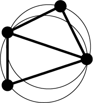
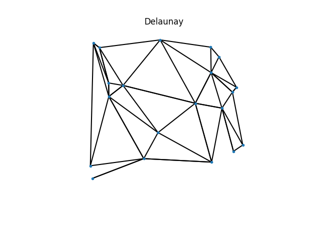
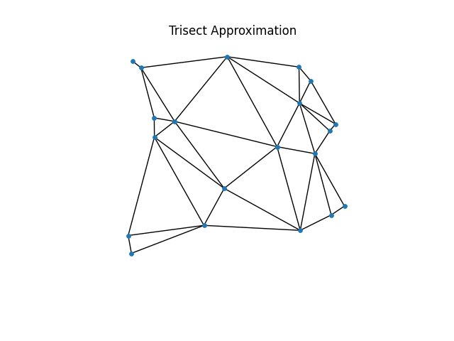

<p align="center">
  </img>
</p>

<div align="center">
<h3 max-width='200px' align="center">Trisect</h3>
  <p><i>Sample edges of the delaunay triangulation.<br/>
  Blazingly fast and exact.<br/>
  Built with Rust</i><br/></p>
  <p>
    
  </p>
</div>

#

### Contents
- [Installation](#installation) 
- [Usage](#usage)
- [How does it work](#how-does-it-work)


<p align="center">
  
  
</p>

Trisect is a package to sample edges of the Delaunay triangulation.
It is very fast and converges in limit to the entire Delaunay triangulation, specially in lower dimensions.
Trisect only returns edges from the Delaunay triangulation, so the resulting triangulation is always a subset of the Delaunay.

## Installation

Pre-built packages currently for MacOS, Windows and Linux systems are available in [PyPI](https://pypi.org/project/trisect/) and can be installed with:

```sh
pip install trisect
```
On uncommon architectures, you may need to first
[install Cargo](https://doc.rust-lang.org/cargo/getting-started/installation.html) before running `pip install trisect`.


## Usage
```python
from trisect import delaunay
edges = delaunay(points, n_points=2000, parallel=False)
```
**Parameters:**
 -  ``points``: numpy array of shape (samples,features) with the data points.
 -  ``n_points``: This determines the number of points sampled by the algorithm. More points equates for a denser triangulation but slows the algorithm. Note that `n_points` also equates to the maximum number of edges that it will attempt to find. Default is 1000.
 -  ``parallel``: boolean (default `True`)
 
**Returns:**
 -  ``edges``: numpy array (m, 2) corresponding to the found edges, `m` is always less than `n_points`.


## How does it work?
Trisect works in exploiting the connection of the Delaunay triangulation and the Voronoi cover.
Given a Delaunay triangulation is the nerve of a Voronoi cover, it means that an edge `(i,j)` belongs to the triangulation if there exists some point in the vector space such that its first nearest neighbors are `i` and `j`.
The method simply randomly samples a point and saves the two nearest neighbours.
Very paralelizable and with a sufficient number of samples creates all Delaunay edges.
 
